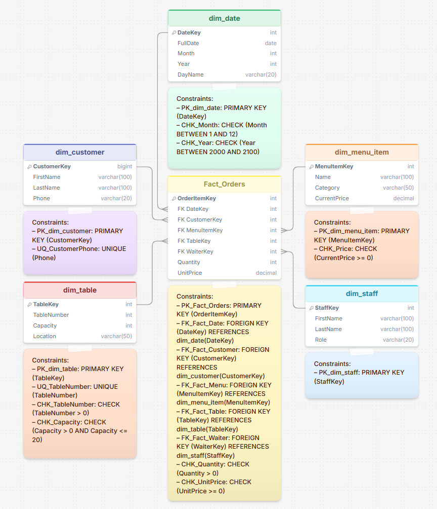

# ПРОЕКТИРОВАНИЕ DATA WAREHOUSE

## Система бронирования в ресторане

---

## 1. Бизнес-процесс

Бронирование столиков и обслуживание гостей — процесс, включающий:

- **Назначение и учёт персонала.** Каждое бронирование закрепляется за конкретным сотрудником, что упрощает контроль качества и распределение задач.

- **Управление загрузкой зала.** Ресторан получает актуальную информацию о занятости столов на конкретное время, что позволяет оптимально распределять гостей.

- **Автоматизация процесса бронирования.** Система позволяет фиксировать бронирования столиков в электронном виде, минимизируя риск человеческой ошибки.

- **Сбор и анализ истории клиентов.** Система накапливает историю посещений, что позволяет отслеживать предпочтения гостей, их любимые блюда и частоту визитов.

---

## 2. Уровень детализации (Grain)

При проектировании *Data Warehouse* для системы бронирования ресторана были рассмотрены два возможных уровня детализации для таблицы фактов:

1. **Одна строка = одна позиция в заказе гостя.** В этом случае каждая строка таблицы фактов представляет собой отдельный заказанный пункт меню: конкретное блюдо, напиток или десерт, выбранный гостем в рамках одного визита.

2. **Одна строка = одно бронирование столика.** В этом случае каждая строка соответствует целому визиту гостя и содержит информацию по заказу: общую сумму, количество гостей, время прибытия и ухода, но без детализации по конкретным блюдам.

**В результате, выбран был уровень детализации «одна строка = одна позиция в заказе», обеспечивающий максимальную гибкость аналитики и позволяющий отвечать на все ключевые бизнес-вопросы ресторана.**

---

## 3. Таблицы измерений и таблица фактов

### 3.1. dim_date (КОГДА?)

**Description:** Хранение календарных дат для аналитики по времени.

**Attributes:**

| Attribute | Type | Constraints |
|---|---|---|
| DateKey | INTEGER | PK |
| FullDate | DATE | NOT NULL |
| Month | INTEGER | NOT NULL |
| Year | INTEGER | NOT NULL |
| DayName | VARCHAR(20) | NOT NULL |

**Constraints:**
- `PK_dim_date`: PRIMARY KEY (DateKey)
- `CHK_Month`: CHECK (Month BETWEEN 1 AND 12)
- `CHK_Year`: CHECK (Year BETWEEN 2000 AND 2100)

---

### 3.2. dim_customer (КТО?)

**Description:** Хранение информации о клиентах ресторана.

**Attributes:**

| Attribute | Type | Constraints |
|---|---|---|
| CustomerKey | BIGINT | PK |
| FirstName | VARCHAR(100) | NOT NULL |
| LastName | VARCHAR(100) | NOT NULL |
| Phone | VARCHAR(20) | UNIQUE |

**Constraints:**
- `PK_dim_customer`: PRIMARY KEY (CustomerKey)
- `UQ_CustomerPhone`: UNIQUE (Phone)

---

### 3.3. dim_menu_item (ЧТО?)

**Description:** Хранение информации о блюдах и напитках из меню ресторана.

**Attributes:**

| Attribute | Type | Constraints |
|---|---|---|
| MenuItemKey | INTEGER | PK |
| Name | VARCHAR(100) | NOT NULL |
| Category | menu_category | NOT NULL |
| CurrentPrice | DECIMAL(10,2) | NOT NULL |

**Constraints:**
- `PK_dim_menu_item`: PRIMARY KEY (MenuItemKey)
- `CHK_Price`: CHECK (CurrentPrice >= 0)

---

### 3.4. dim_table (ГДЕ?)

**Description:** Хранение информации о столах и зонах ресторана.

**Attributes:**

| Attribute | Type | Constraints |
|---|---|---|
| TableKey | INTEGER | PK |
| TableNumber | INTEGER | NOT NULL, UNIQUE |
| Capacity | INTEGER | NOT NULL |
| Location | table_location | NOT NULL |

**Constraints:**
- `PK_dim_table`: PRIMARY KEY (TableKey)
- `UQ_TableNumber`: UNIQUE (TableNumber)
- `CHK_TableNumber`: CHECK (TableNumber > 0)
- `CHK_Capacity`: CHECK (Capacity > 0 AND Capacity <= 20)

---

### 3.5. dim_staff (КТО ОБСЛУЖИВАЕТ?)

**Description:** Хранение информации о сотрудниках ресторана.

**Attributes:**

| Attribute | Type | Constraints |
|---|---|---|
| StaffKey | INTEGER | PK |
| FirstName | VARCHAR(100) | NOT NULL |
| LastName | VARCHAR(100) | NOT NULL |
| Role | staff_role | NOT NULL |

**Constraints:**
- `PK_dim_staff`: PRIMARY KEY (StaffKey)

---

### 3.6. Fact_Orders

**Description:** Фактовая таблица заказов — хранит каждую позицию заказа со ссылками на измерения.

**Attributes:**

| Attribute | Type | Constraints |
|---|---|---|
| OrderItemKey | INTEGER | PK |
| DateKey | INTEGER | NOT NULL, FK → dim_date(DateKey) |
| CustomerKey | BIGINT | NOT NULL, FK → dim_customer(CustomerKey) |
| MenuItemKey | INTEGER | NOT NULL, FK → dim_menu_item(MenuItemKey) |
| TableKey | INTEGER | NOT NULL, FK → dim_table(TableKey) |
| WaiterKey | INTEGER | NOT NULL, FK → dim_staff(StaffKey) |
| Quantity | INTEGER | NOT NULL, метрика |
| UnitPrice | DECIMAL(8,2) | NOT NULL, метрика |

**Constraints:**
- `PK_Fact_Orders`: PRIMARY KEY (OrderItemKey)
- `FK_Fact_Date`: FOREIGN KEY (DateKey) REFERENCES dim_date(DateKey)
- `FK_Fact_Customer`: FOREIGN KEY (CustomerKey) REFERENCES dim_customer(CustomerKey)
- `FK_Fact_Menu`: FOREIGN KEY (MenuItemKey) REFERENCES dim_menu_item(MenuItemKey)
- `FK_Fact_Table`: FOREIGN KEY (TableKey) REFERENCES dim_table(TableKey)
- `FK_Fact_Waiter`: FOREIGN KEY (WaiterKey) REFERENCES dim_staff(StaffKey)
- `CHK_Quantity`: CHECK (Quantity > 0)
- `CHK_UnitPrice`: CHECK (UnitPrice >= 0)

---

## 4. Физическая Star-схема

---

*Документ подготовлен в рамках домашнего задания по проектированию хранилища данных.*
