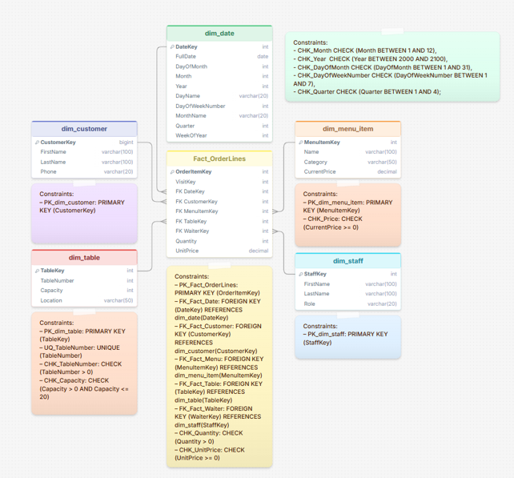

# Проектирование Data Warehouse

## Система бронирования в ресторане

---

### 1. Бизнес-процесс

Бронирование столиков и обслуживание гостей — процесс, включающий:

- **Назначение и учёт персонала.** Каждое бронирование закрепляется за конкретным сотрудником, что упрощает контроль качества и распределение задач.
- **Управление загрузкой зала.** Ресторан получает актуальную информацию о занятости столов на конкретное время, что позволяет оптимально распределять гостей.
- **Автоматизация процесса бронирования.** Система позволяет фиксировать бронирования столиков в электронном виде, минимизируя риск человеческой ошибки.
- **Сбор и анализ истории клиентов.** Система накапливает историю посещений, что позволяет отслеживать предпочтения гостей, их любимые блюда и частоту визитов.

---

### 2. Уровень детализации (Grain)

При проектировании *Data Warehouse* для системы бронирования ресторана были рассмотрены два возможных уровня детализации для таблицы фактов:

1. **Одна строка = одна позиция в заказе гостя.** В этом случае каждая строка таблицы фактов представляет собой отдельный заказанный пункт меню: конкретное блюдо, напиток или десерт, выбранный гостем в рамках одного визита.
2. **Одна строка = одно бронирование столика.** В этом случае каждая строка соответствует целому визиту гостя и содержит информацию по заказу: общую сумму, количество гостей, время прибытия и ухода, но без детализации по конкретным блюдам.

**Выбранный уровень детализации:** *одна строка = одна позиция в заказе* — обеспечивает максимальную гибкость аналитики и позволяет отвечать на все ключевые бизнес-вопросы ресторана.

---

### 3. Таблицы измерений и таблица фактов

#### 3.1. `dim_date` — КОГДА?

Хранение календарных дат для аналитики по времени.

| Атрибут | Тип | Описание |
|---------|-----|----------|
| `DateKey` | `INT PRIMARY KEY` | Суррогатный ключ |
| `FullDate` | `DATE NOT NULL` | Полная дата |
| `DayOfMonth` | `INT NOT NULL` | День месяца |
| `Month` | `INT NOT NULL` | Месяц |
| `Year` | `INT NOT NULL` | Год |
| `DayName` | `VARCHAR(20) NOT NULL` | Название дня недели |
| `DayOfWeekNumber` | `INT NOT NULL` | Номер дня недели |
| `MonthName` | `VARCHAR(20) NOT NULL` | Название месяца |
| `Quarter` | `INT NOT NULL` | Квартал |
| `WeekOfYear` | `INT NOT NULL` | Номер недели в году |

**Constraints:**
- `CHK_Month` — `Month BETWEEN 1 AND 12`
- `CHK_Year` — `Year BETWEEN 2000 AND 2100`
- `CHK_DayOfMonth` — `DayOfMonth BETWEEN 1 AND 31`
- `CHK_DayOfWeekNumber` — `DayOfWeekNumber BETWEEN 1 AND 7`
- `CHK_Quarter` — `Quarter BETWEEN 1 AND 4`

---

#### 3.2. `dim_customer` — КТО?

Хранение информации о клиентах ресторана.

| Атрибут | Тип | Описание |
|---------|-----|----------|
| `CustomerKey` | `INT PK` | Суррогатный ключ |
| `FirstName` | `VARCHAR(100) NOT NULL` | Имя |
| `LastName` | `VARCHAR(100) NOT NULL` | Фамилия |
| `Phone` | `VARCHAR(20) UNIQUE` | Телефон |

---

#### 3.3. `dim_menu_item` — ЧТО?

Хранение информации о блюдах и напитках из меню ресторана.

| Атрибут | Тип | Описание |
|---------|-----|----------|
| `MenuItemKey` | `INTEGER PK` | Суррогатный ключ |
| `Name` | `VARCHAR(100) NOT NULL` | Название блюда |
| `Category` | `menu_category NOT NULL` | Категория |
| `CurrentPrice` | `DECIMAL(8,2) NOT NULL` | Текущая цена |

**Constraints:**
- `CHK_Price` — `CurrentPrice >= 0`

---

#### 3.4. `dim_table` — ГДЕ?

Хранение информации о столах и зонах ресторана.

| Атрибут | Тип | Описание |
|---------|-----|----------|
| `TableKey` | `INTEGER PK` | Суррогатный ключ |
| `TableNumber` | `INTEGER NOT NULL UNIQUE` | Номер стола |
| `Capacity` | `INTEGER NOT NULL` | Вместимость |
| `Location` | `table_location NOT NULL` | Расположение |

**Constraints:**
- `UQ_TableNumber` — `UNIQUE (TableNumber)`
- `CHK_TableNumber` — `TableNumber > 0`
- `CHK_Capacity` — `Capacity > 0 AND Capacity <= 20`

---

#### 3.5. `dim_staff` — КТО ОБСЛУЖИВАЕТ?

Хранение информации о сотрудниках ресторана.

| Атрибут | Тип | Описание |
|---------|-----|----------|
| `StaffKey` | `INTEGER PK` | Суррогатный ключ |
| `FirstName` | `VARCHAR(100) NOT NULL` | Имя |
| `LastName` | `VARCHAR(100) NOT NULL` | Фамилия |
| `Role` | `staff_role NOT NULL` | Должность |

---

#### 3.6. `Fact_OrderLines`

Фактовая таблица заказов — хранит каждую позицию заказа со ссылками на измерения.

| Атрибут | Тип | Описание |
|---------|-----|----------|
| `OrderItemKey` | `INTEGER PK` | Суррогатный ключ строки |
| `VisitKey` | `INT NOT NULL` | Ключ визита |
| `DateKey` | `INTEGER NOT NULL` | FK → `dim_date` |
| `CustomerKey` | `BIGINT NOT NULL` | FK → `dim_customer` |
| `MenuItemKey` | `INTEGER NOT NULL` | FK → `dim_menu_item` |
| `TableKey` | `INTEGER NOT NULL` | FK → `dim_table` |
| `WaiterKey` | `INTEGER NOT NULL` | FK → `dim_staff` |
| `Quantity` | `INTEGER NOT NULL` | **Метрика** — количество |
| `UnitPrice` | `DECIMAL(8,2) NOT NULL` | **Метрика** — цена за единицу |

**Constraints:**
- `PK_Fact_OrderLines` — `PRIMARY KEY (OrderItemKey)`
- `FK_Fact_Date` — `FOREIGN KEY (DateKey) REFERENCES dim_date(DateKey)`
- `FK_Fact_Customer` — `FOREIGN KEY (CustomerKey) REFERENCES dim_customer(CustomerKey)`
- `FK_Fact_Menu` — `FOREIGN KEY (MenuItemKey) REFERENCES dim_menu_item(MenuItemKey)`
- `FK_Fact_Table` — `FOREIGN KEY (TableKey) REFERENCES dim_table(TableKey)`
- `FK_Fact_Waiter` — `FOREIGN KEY (WaiterKey) REFERENCES dim_staff(StaffKey)`
- `CHK_Quantity` — `Quantity > 0`
- `CHK_UnitPrice` — `UnitPrice >= 0`

---

### 4. Физическая Star-схема

